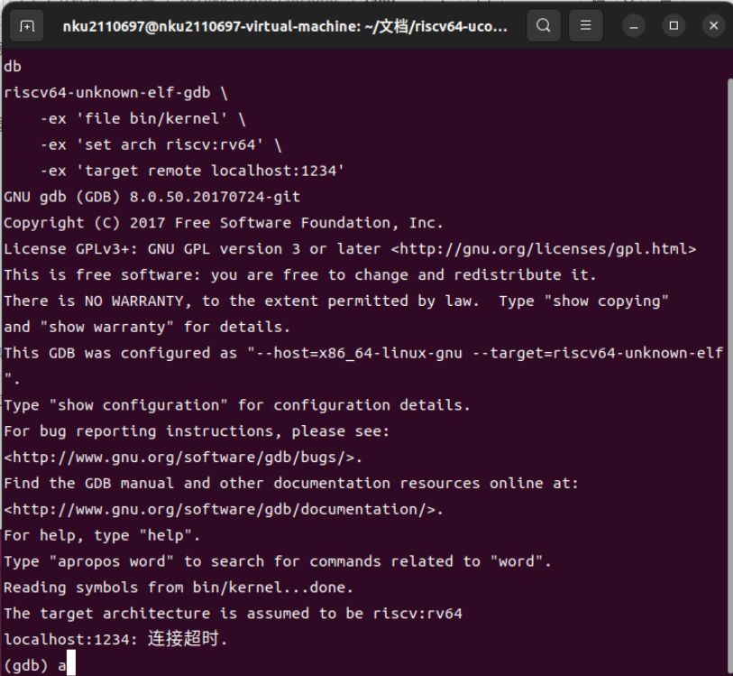
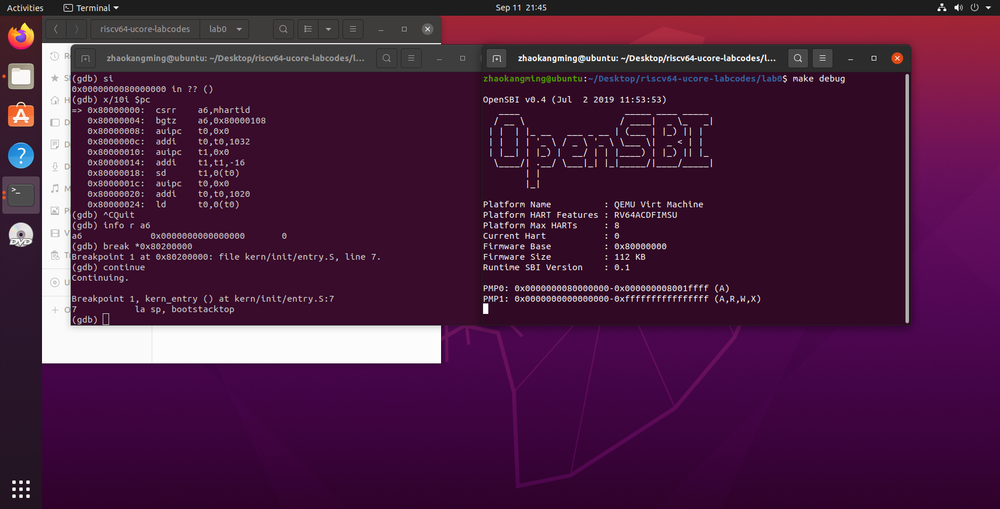

# lab0.5实验报告
## 一、实验目的
实验 0.5 主要讲解最小可执行内核和启动流程。我们的内核主要在 Qemu 模拟器上运行，它可以模拟一台 64位 RISC-V 计算机。为了让我们的内核能够正确对接到 Qemu 模拟器上，需要了解 Qemu 模拟器的启动流程，还需要一些程序内存布局和编译流程（特别是链接）相关知识。  
本章将会学到：  
• 使用链接脚本描述内存布局  
• 进行交叉编译生成可执行文件，进而生成内核镜像  
• 使用 OpenSBI 作为 bootloader 加载内核镜像，并使用 Qemu 进行模拟  
• 使用 OpenSBI 提供的服务，在屏幕上格式化打印字符串用于以后调试  
## 二、实验内容与要求
实验 0.5 主要讲解最小可执行内核和启动流程。我们的内核主要在 Qemu 模拟器上运行，它可以模拟一台 64位 RISC-V 计算机。为了让我们的内核能够正确对接到 Qemu 模拟器上，需要了解 Qemu 模拟器的启动流程，还需要一些程序内存布局和编译流程（特别是链接）相关知识, 以及通过 opensbi 固件来通过服务。   
对实验报告的要求：  
• 基于 markdown 格式来完成，以文本方式为主  
• 填写各个基本练习中要求完成的报告内容  
• 完成实验后，请分析 ucore_lab 中提供的参考答案，并请在实验报告中说明你的实现与参考答案的区别  
• 列出你认为本实验中重要的知识点，以及与对应的 OS 原理中的知识点，并简要说明你对二者的含义，
关系，差异等方面的理解（也可能出现实验中的知识点没有对应的原理知识点）  
• 列出你认为 OS 原理中很重要，但在实验中没有对应上的知识点  
练习 1: 使用 GDB 验证启动流程  
为了熟悉使用 qemu 和 gdb 进行调试工作, 使用 gdb 调试 QEMU 模拟的 RISC-V 计算机加电开始运行到执行应用程序的第一条指令（即跳转到 0x80200000）这个阶段的执行过程，说明 RISC-V 硬件加电后的几条指令
在哪里？完成了哪些功能？要求在报告中简要写出练习过程和回答。
## 三、实验步骤与过程
### 1.结合 gdb 和 qemu 调试实验文件，完成练习1
使用Makefile 中的 make debug 和 make gdb 指令，（*如果不先debug会出现如下的connect time out情况*）

正确调试后，我们首先使用指令x/10i $pc，显示即将执行的 10 条汇编指令，可以观察到如下的0x1000处开始后的十条指令
```
0x1000:	auipc	t0, 0x0       // 将当前地址的高20位与偏移量0x0相加，存储在寄存器t0中
0x1004:	addi	a1, t0, 32    // 将寄存器t0的值与偏移量32相加，存储在寄存器a1中
0x1008:	csrr	a0, mhartid   // 将mhartid寄存器的值加载到寄存器a0中
0x100c:	ld	t0, 24(t0)     // 从地址为t0加24的内存单元中加载双字数据，并将其存储在寄存器t0中
0x1010:	jr	t0             // 跳转到寄存器t0所存储的地址
0x1014:	unimp               // 未实现的指令
0x1016:	unimp               // 未实现的指令
0x1018:	unimp               // 未实现的指令
0x101a:	0x8000              // 表示一个16位的数值0x8000
0x101c:	unimp               // 未实现的指令
 ```
**（为什么是1000：resetvec的宏定义的初始值为0x1000然后将reservec的值赋给了pc 所以pc的初始值为0x1000）**  

执行下一条指令：PC为0x1004，info r t0发现t0的值为0x0000000000001000，AUIPC指令的操作是将一
个符号扩展的立即数（通常是一个符号偏移量或全局地址）左移12位（即乘以2^12），然后将当前PC的值加到这个结果上，最终将结果存储到目标寄存器中。因为此时的立即数为0x0，所以将原本的0x1000左边移做符号扩展12位得到这个结果。

执行下一条指令：此时PC为0x1008，查看a1的寄存器的值为0x0000000000001020，即t1+0x20.

执行下一条指令：PC为0x100C，csrr指令的作用是将当前硬件的id加载到a0的寄存器当中，查看a0寄存
器的内容，发现为0，那就是用了0号硬件！

执行下一条指令：PC为PC0x1010，ld（Load Doubleword）指令，用于从寄存器t0指向的内存地址偏移
24处加载一个双字（64位数据）到寄存器t0中。查看此时t0寄存器的值，为0x0000000080000000。这里有个值得注意的地方。在我们给t0的地址加上24的时候，我们直到此时的t0地址是0x1000。加上24（10进制）之后，t0读取到的应该是0x1018（10进制的24=16进制的18）。我们注意到此时的0x1018是unimp。但是事实上这个unimp是没有定义的指令，也就是说这里存在数据但是机器搞不懂这是什么东西。使用x/g 0x1018来查看0x1018的内容，发现那里存的是2147483648。这个转化为16进制就是80000000

执行下一条指令：跳转指令，跳转到内存地址为0x000000008000000处，而QEMU的复位代码指定加载
Bootloader的位置为0x80000000，此时Bootloader将加载操作系统内核并启动操作系统的执行。

输入指令x/10i 0x80000000，观察到0x80000000 处的 10 条汇编指令如下：
~~~
0x80000000:	csrr	a6, mhartid    // 将mhartid（硬件线程ID）寄存器的值加载到寄存器a6中
0x80000004:	bgtz	a6, 0x80000108  // 如果a6大于零，则跳转到地址0x80000108
0x80000008:	auipc	t0, 0x0         // 将当前地址的高20位与偏移量0x0相加，存储在寄存器t0中
0x8000000c:	addi	t0, t0, 1032    // 将寄存器t0的值与偏移量1032相加，存储在寄存器t0中
0x80000010:	auipc	t1, 0x0         // 将当前地址的高20位与偏移量0x0相加，存储在寄存器t1中
0x80000014:	addi	t1, t1, -16     // 将寄存器t1的值与偏移量-16相加，存储在寄存器t1中
0x80000018:	sd	t1, 0(t0)        // 将寄存器t1的值存储到以寄存器t0为起始地址的内存中
0x8000001c:	auipc	t0, 0x0         // 将当前地址的高20位与偏移量0x0相加，存储在寄存器t0中
0x80000020:	addi	t0, t0, 1020    // 将寄存器t0的值与偏移量1020相加，存储在寄存器t0中
0x80000024:	ld	t0, 0(t0)        // 从以寄存器t0为起始地址的内存中加载双字数据，并将其存储在寄存器t0中
~~~

接下来我们在0x80200000处打断点，然后continue执行到断点处，然后就启动了QEMU预先加载好的内核镜像。



