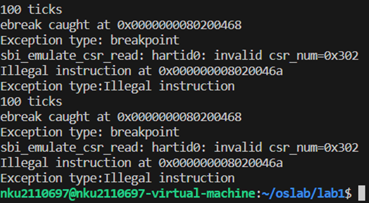
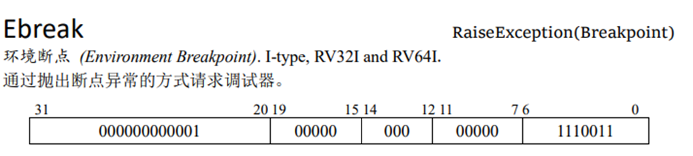
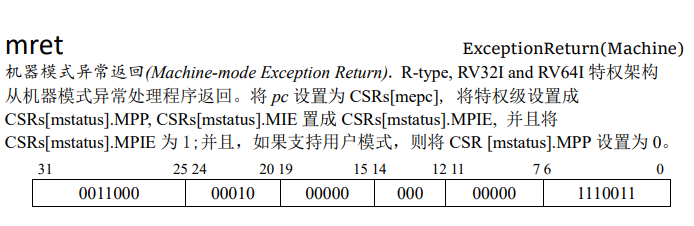
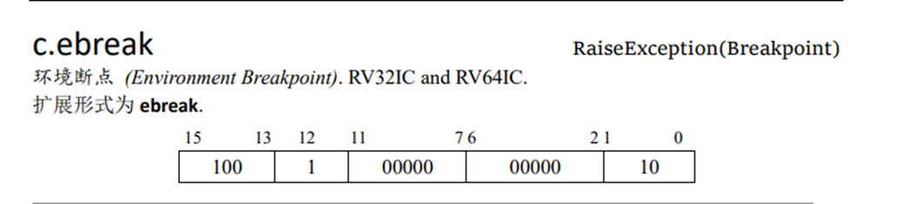

# Lab1 实验报告
## 练习1：理解内核启动中的程序入口操作

    阅读 kern/init/entry.S内容代码，结合操作系统内核启动流程，说明指令 la sp, bootstacktop 完成了什么操作，目的是什么？ tail kern_init 完成了什么操作，目的是什么？
- la sp, bootstacktop的作用：用于加载一个地址（bootstacktop的地址）到栈指针寄存器（sp）。这是为了设置初始的内核栈。（设置内核的初始栈空间的作用是为了在进程从用户态切换到内核态时，为内核代码提供一个可用的栈空间。内核栈是进程私有的，每个进程都有一个单独的内核栈，大小一般为8KB或16KB，取决于体系结构和配置。内核栈的位置在内核的内存区域中，只有内核能够访问，用户进程无法访问。如果没有设置内核的初始栈空间，那么进程在执行系统调用或中断时，就没有地方保存这些信息，可能会导致内存错误或数据丢失。因此，设置内核的初始栈空间是为了保证进程在内核态运行时的正常功能和安全性。
  
- tail 指令的目的是跳转到 kern_init 函数并开始执行它。但是，它使用了 "尾递归调用"（tail call）的方式，这在汇编语言中是一种特殊的函数调用形式，它在调用结束后不会返回到原始的函数调用点，而是直接跳转到被调用函数的代码。

## 练习2：完善中断处理 （需要编程）
    请编程完善trap.c中的中断处理函数trap，在对时钟中断进行处理的部分填写kern/trap/trap.c函数中处理时钟中断的部分，使操作系统每遇到100次时钟中断后，调用print_ticks子程序，向屏幕上打印一行文字”100 ticks”，在打印完10行后调用sbi.h中的shut_down()函数关机。
    要求完成问题1提出的相关函数实现，提交改进后的源代码包（可以编译执行），并在实验报告中简要说明实现过程和定时器中断中断处理的流程。实现要求的部分代码后，运行整个系统，大约每1秒会输出一次”100 ticks”，输出10行。

- 实现代码：
    
    
            clock_set_next_event();//设置时钟中断
            if(++ticks%TICK_NUM==0){
                print_ticks();
                num++;
                if(num==10)
                {
                    sbi_shutdown();
                }
            }

- 实现过程：

    1.首先调用clock_set_next_event函数，因为QEMU的时钟频率为10MHz,时钟间隔中断设置为CPU频率的1%，因此其间隔为1*10^5，所以timebase的值被设置为100000。而clock_set_next_event函数的声明如下：

        void clock_set_next_event(void) { sbi_set_timer(get_time() + timebase); }

    在这个函数中调用了sbi_set_timer这一函数，该函数的声明如下：

        void sbi_set_timer(unsigned long long stime_value) { sbi_call(SBI_SET_TIMER, stime_value, 0, 0);
    当time寄存器(rdtime的返回值)为stime_value的时候触发一个时钟中断

        这样就设置好了下一次的时钟中断。

    2.ticks每次都会增加1，如果其能够模TICK_NUM(100)为0，则会打印输出调用print_ticks打印100 ticks。同时num自增1，当num=10即打印10次后调用sbi_shutdown进行关机。

## 扩展练习 Challenge1：
    回答：描述ucore中处理中断异常的流程（从异常的产生开始），其中mov a0，sp的目的是什么？SAVE_ALL中寄寄存器保存在栈中的位置是什么确定的？对于任何中断，__alltraps 中都需要保存所有寄存器吗？请说明理由。
异常处理的流程：

    1、关中断（CPU不再响应更高级的中断
    2、保存断点以便能回来。（一般是保存程序计数器pc）
    3、引出（也就是大概是读取这个程序的入口地址，以便后面执行）中断执行程序（也就是我们要中断当前的，然后去执行的东西。
    4、保存现场和关键字。
    5、开中断（）
    6、执行中断服务程序（此时可以并发响应其他中断）
    7、关中断
    8、恢复现场
    9、开中断
    10、中断返回。
在我们“只有麻雀骨架”的代码里，大概能实现这些基本功能：保存当前状态，跳转到终端执行程序，然后再跳转回来。

关于是否要保存所有的寄存器，虽然光是从代码上来看，这里的__alltraps应该是把所有寄存器都保存了，而且这么操作省事，在寄存器不多的情况下也没什么大碍，但是理论上只需要把关键的寄存器（如pc等）保存，然后当前程序使用并且赋值了的a0、t0之类的寄存器保存即可。

mov a0, sp这个是传递参数用的（a0寄存器就是干这事儿的）。把这个打包好的结构体发给trap函数。（这个打包好的结构体就叫tf。（tf.epc就是异常处理寄存器了）

## 扩展练习 Challenge2：
    回答：在trapentry.S中汇编代码 csrw sscratch, sp；csrrw s0, sscratch, x0实现了什么操作，目的是什么？save all里面保存了stval scause这些csr，而在restore all里面却不还原它们？那这样store的意义何在呢？

- csrw sscratch, sp:#保存栈顶指针到sscratch。到时候恢复回来就靠这个了。执行完之后，把所有寄存器手牵手连着存到当前栈底部开始间隔寄存器大小的内存空间。

- csrrw s0, sscratch, x0实现了把sscratch（也就是sp）的值存到s0里，再把x0的值存到sscratch里。这里x0是zero寄存器，用来把sscratch清零（这个不是主要目的），这里是要把sp经过sscratch之后存到s0里面，然后s0再保存到 uintptr_t sp;位
来看看没有恢复的csr寄存器：sbadaddr寄存器用于存储导致异常的地址。这里导致异常的东西我们的trap已经处理过了，因此不需要再进行恢复。scause寄存器包含了导致异常或中断发生的原因的代码。已经处理完了也没必要再恢复了。

    总而言之，这些寄存器不需要恢复是因为它们和恢复后的运行状态没有关系，这些异常已经移交由trap.c处理了。store的意义是：将状态寄存器作为参数传入trap.c中进行异常处理。

## 扩展练习Challenge3：完善异常中断
    编程完善在触发一条非法指令异常 mret和一条断点异常，在 kern/trap/trap.c的异常处理函数中捕获，并对其进行处理，简单输出异常类型和异常指令触发地址，即“Illegal instruction caught at 0x(地址)”，“ebreak caught at 0x（地址）”与“Exception type:Illegal instruction”，“Exception type: breakpoint”。
### 实验代码
对异常处理函数exception_handler更改的地方如下：

~~~
case CAUSE_ILLEGAL_INSTRUCTION:
             // 非法指令异常处理
             /* LAB1 CHALLENGE3:  */
            /*(1)输出指令异常类型（ Illegal instruction）
             *(2)输出异常指令地址
             *(3)更新 tf->epc寄存器
            */
            //当前指令
            cprintf("Illegal instruction at 0x%016llx\n", tf->epc);
            cprintf("Exception type:Illegal instruction\n");
            //RISC - V 中的 mret 指令通常是 4 字节长（32位），所以要+4.
            tf->epc += 4;
            break;
        case CAUSE_BREAKPOINT:
            //断点异常处理
            /* LAB1 CHALLLENGE3:  */
            /*(1)输出指令异常类型（ breakpoint）
             *(2)输出异常指令地址
             *(3)更新 tf->epc寄存器
            */
            cprintf("ebreak caught at 0x%016llx\n", tf->epc);
            cprintf("Exception type: breakpoint\n");
            //我们实验中RISC - V 中的 ebreak 指令通常是 2 字节长（16位），所以要+2而不是+4.
            tf->epc += 2;
            break;
~~~
我们选择将断点和异常指令设置到每次打印100ticks后，用ebreak设置断点，用mret当做一条异常指令，断点和异常指令设置代码如下：
~~~
if (++ticks % TICK_NUM == 0) {
                print_ticks();
                __asm__ volatile ("ebreak");//为了观察断点异常是否能正常输出，我们在这里打印ticks的同时触发一个ebreak指令。
                __asm__ volatile ("mret");//为了观察违法指令异常是否能正常输出，我们在这里打印ticks的同时触发一个mret指令。
                if (ticks == 1000)
                    sbi_shutdown();
            }
~~~            

### 实验结果：
实验结果是每次打印100ticks时，也能同时报告非法指令异常和断点异常，部分结果显示在如下图片：

 
### 实验过程中注意的问题和细节：
#### 更新tf->epc寄存器

我们的目的是更改异常处理函数输出指令异常类型和异常指令地址，这件事情实际上很简单，只需要用cprintf函数打印即可，重点在于更新tf->epc寄存器的值。我们在前面练习一的时候，进行了中断操作，在我们对中断的操作后，我们并没有更新tf->epc寄存器的值，而在这里，我们进行异常处理操作后，却需要更新tf->epc寄存器的值。这是由于处理中断后的恢复中，只需要回到原地；而在处理异常的恢复中，需要跳过这条异常指令，以便接下来指令的执行，所以我们要更新tf->epc寄存器，让他储存异常下一条指令的地址。

我们现在已经明白了要执行异常指令的下一条指令，因而我们要进行的操作就是将tf->epc寄存器目前存储的地址加上现在遇到的异常指令的长度，就可以跳过异常指令，执行下一条指令了。

但是还有一个问题没有解决——加几。对于正常的RISC-V指令集架构中，一般指令的长度都是4字节（32位）。我们最初的修改就是在非法指令异常和断点异常操作后都给tf->epc寄存器的值加4。但是，这却并不能正常的打印我们想要的结果。于是我们通过查阅指导手册中的参考资料RISC-V手册，但是却发现手册中这两个指令的长度也确实都是4字节。
 

 

于是我们继续查阅资料，发现我们现在实验中使用的指令集经过了“压缩”，这里的ebreak指令实际上是c.ebreak,指令长度实际上缩减为2字节（16位）。

于是我们终于得出对非法指令异常，给tf->epc寄存器的值加4；而对断点异常操作，给tf->epc寄存器的值加2。

最终打印是地址也验证了我们更改的正确性，我们实验中，断点异常的下一条指令就是非法指令异常，而结果显示ebreak caught at 0x0000000080200468，Illegal instruction at 0x000000008020046a。这两个地址差2字节，这说明ebreak指令确实长为2字节。

#### 关于mret指令
我们观察到输出结果中还有一句:sbi_emulate_csr_read: hartid0: invalid csr_num=0x302,这句话值得关注。这句话意为我们尝试读取了不支持的CSR寄存器，而这个CSR编号0x302是mepc寄存器的编号。mepc寄存器在RISC-V架构中用于存储发生异常时的指令地址。当异常发生时，处理器会将异常的下一条指令的地址保存到mepc寄存器中，以便在异常处理完成后能够正确返回到异常发生的位置继续执行。

为什么会这样？这就和我们使用的mret指令有关了。mret指令是一条特权指令，根据参考资料RISC-V手册，它的的执行过程如下：

- 从指定的异常处理程序返回上下文。  
- 恢复保存的程序计数器（PC）的值，将控制流恢复到异常发生时的下一条指令。  
- 恢复保存的状态寄存器（SSTATUS）的值，包括特权级别、中断使能等。  
- 恢复其他保存的寄存器和状态，使处理器回到正常的执行状态。  

注意到过程中，mret指令会读取mepc寄存器，将PC设置为mepc。但是，手册中同样指出，在用户模式下执行mret指令会导致非法指令异常，而这就是显示sbi_emulate_csr_read: hartid0: invalid csr_num=0x302的原因了。同样的，这也正是我们能在代码中插入mret指令来当做非法指令来进行实验的原因。

