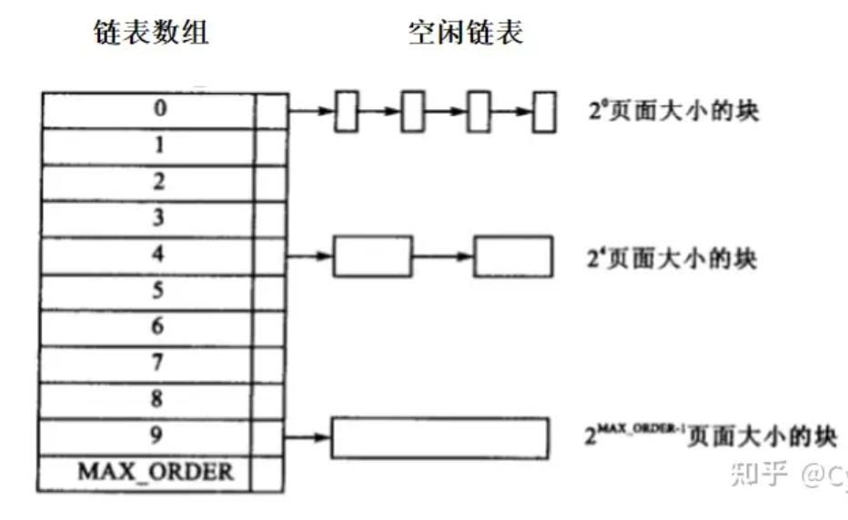

# Lab2 report

## 练习1：理解first-fit 连续物理内存分配算法（思考题）

> first-fit 连续物理内存分配算法作为物理内存分配一个很基础的方法，需要同学们理解它的实现过程。请大家仔细阅读实验手册的教程并结合`kern/mm/default_pmm.c`中的相关代码，认真分析default_init，default_init_memmap，default_alloc_pages， default_free_pages等相关函数，并描述程序在进行物理内存分配的过程以及各个函数的作用。 请在实验报告中简要说明你的设计实现过程。
>

First-fit(首次适应算法)：首次适应算法从空闲分区表的第一个表目起查找该表，把最先能够满足要求的空闲区分配给作业，这种方法目的在于减少查找时间。为适应这种算法，空闲分区表(空闲区链)中的空闲分区要按地址由低到高进行排序。

**优点**：该算法倾向于使用内存中低地址部分的空闲区，在高地址部分的空闲区很少被利用，从而保留了高地址部分的大空闲区。显然为以后到达的大作业分配大的内存空间创造了条件。

**缺点**：低地址部分不断被划分，留下许多难以利用、很小的空闲区，而每次查找又都从低地址部分开始，会增加查找的开销。

```c#
default_init(void)
{
    list_init(&free_list);//初始化空闲内存块列表free_list，将prev和next指针都指向自身
    nr_free = 0;//空闲内存块计数器归零
}
```

```c#
//memlayout.h
struct Page {
    int ref;                        // 表示这页被页表的引用记数。如果这个页被页表引用了，即在某页表中有一个页表项设置了一个虚拟页到这个Page管理的物理页的映射关系，就会把Page的ref+1；反之，若页表项取消，即映射关系解除，就会把Page的ref -1
    uint64_t flags;                 // 表示此物理页的状态标记，其中bit 0表示此页是否被保留，保留的页将不能进行动态的分配和释放。bit 1表示此页是否是free的，如果为1，则是free的，如果为0则表示被分配出去了，不能二次分配
    unsigned int property;          // 用来记录某连续内存空闲块的大小（即地址连续的空闲页的个数）,只有连续空闲空间的第一页才会用到这个成员变量，其页的这个值都为0
    list_entry_t page_link;         // 是便于把多个连续内存空闲块链接在一起的双向链表指针，只链接连续空闲空间的最小的一页（即头一页）
};
```

```c#
default_init_memmap(struct Page *base, size_t n)
// 初始化一个给定地址和大小的空闲块。
// base: 指向第一个页面的指针。n: 页数。
//设置页状态   
{
    assert(n > 0);
    // 遍历从 base 开始的每一个页面，
    // 确保每一页都被预留（PageReserved(p)）。然后清除每一页的标志和属性，并设置其引用计数为0
    struct Page *p = base;

    // test point
    for (; p != base + 3; p++)
    {
        cprintf("p的虚拟地址: 0x%016lx.\n", (uintptr_t)p);
    }
 
    p = base;
    for (; p != base + n; p++)
    {
        assert(PageReserved(p));
        p->flags = p->property = 0;//如果该页是空闲的并且不是空闲块的第一页，则 p->property 应设置为 0
        set_page_ref(p, 0); // 设置引用计数(page的ref成员)为0
    }
    // 设置基本页面的属性
    // 空闲块中第一个页的property属性标志整个空闲块中总页数
    base->property = n;
    // 将这个页面标记为空闲块开始的页面
    // 将page->flag的PG_property位，也就是第1位（总共0-63有64位）设置为1
    SetPageProperty(base);
    // 增加空闲块的数量
    nr_free += n;

    // 将新的空闲块添加到空闲列表中
    // 空闲链表为空就直接添加
    if (list_empty(&free_list))
    {
        list_add(&free_list, &(base->page_link));
        // 这个函数将在para2节点插入在para1后面
    }
    else // 非空的话就遍历链表，找到合适的位置插入
    {
        list_entry_t *le = &free_list;             // 哨兵节点，表示链表的开始和结束。
        while ((le = list_next(le)) != &free_list) // 遍历一轮链表
        {
            struct Page *page = le2page(le, page_link); // le2page从给定的链表节点le获取到包含它的struct Page实例。
            if (base < page)                            // 找到了合适的位置，链表是排序的，便于后续搜索，插入要维持有序状态
            {
                list_add_before(le, &(base->page_link)); // 在当前链表条目之前插入新页面。
                break;
            }
            else if (list_next(le) == &free_list) // 到了链表尾部，循环一轮的最后，直接添加
            {
                list_add(le, &(base->page_link));
            }
        }
    }
}
```

这是一个物理页初始化函数，其功能是将所有可用的Page的flags设置为PG_property，引用计数设置为0，property设置为0，初始化page_link空闲块的第一个物理块的property设置为该空闲块的大小。最后需要把这个初始化的内存块加入到空闲列表中，分为三种情况，插入到表头，表中和表尾，分别调用双向链表中的不同函数即可。

**调用链** kern_init --> pmm_init–>page_init–>init_memmap–> pmm_manager->init_memmap

```c#
default_alloc_pages(size_t n) // 根据最先匹配算法从空闲列表中分配所需数量的页，参数为n，表示需要分配页的大小。
{
    assert(n > 0);
    // 不够分
    if (n > nr_free)
    {
        return NULL;
    }
    // 遍历空闲列表，找到第一个空闲块大小大于等于n的块
    struct Page *page = NULL;// 用于存储分配的页块的指针
    list_entry_t *le = &free_list;//指向空闲页块链表头的指针
    while ((le = list_next(le)) != &free_list)
    {
        struct Page *p = le2page(le, page_link);
        if (p->property >= n)//找到了第一个大于n的块，退出循环
        {
            page = p;
            break;
        }
    }
    if (page != NULL) // 找到了要分配的页，获取这个块前面的链表条目，并从空闲列表中删除这个块。
    {
        list_entry_t *prev = list_prev(&(page->page_link));
        list_del(&(page->page_link));
        if (page->property > n) // 找到的空闲块比请求的大，它将被拆分为两部分
        {
            struct Page *p = page + n;        // p指向剩余部分的第一个页面
            p->property = page->property - n; // 更新剩余部分的空闲块大小
            SetPageProperty(p);               // 设置剩余部分的第一个页面的属性
            list_add(prev, &(p->page_link));  // 将剩余部分添加到空闲列表中
        }
        // 更新空闲页面计数 nr_free，并清除已分配块的属性标志。
        nr_free -= n;
        ClearPageProperty(page);
    }
    return page;//返回用于分配到的物理内存的page结构指针
}
    1.第一种情况(找不到满足需求的可供分配的空闲块(所有的size均 < n))
    2.第二种情况(刚好有满足大小的空闲块)
        执行分配前
        --------------          --------------         -------------
        | size < n   |  <--->   | size = n   |  <--->  | size > n  |
        --------------          --------------         -------------
        执行分配后
        --------------           -------------
        | size < n   |  <--->    | size > n  |
        --------------           -------------
    3.第三种情况(不存在刚好满足大小的空闲块，但存在比其大的空闲块)   
            执行分配前
        --------------          ------------         --------------
        | size < n   |  <--->   | size > n |  <--->  | size > n1  |
        --------------          ------------         --------------
        执行分配后
        --------------          ---------------------         --------------
        | size < n   |  <--->   | size = size - n   |  <--->  | size > n1  |
        --------------          ---------------------         --------------
```

该函数功能是在空闲列表中搜索第一个空闲块(块大小>=n)，如果找到则把找到的page返回。default_alloc_page()根据外界需要的内存页数调整空闲内存块所在的链表free_list。它的实现如下：

1、判断n是否大于0，大于0的合法，并且要保证free页要大于n
        2、第一个while循环，从空闲链表开始查找，找到第一块函数符合条件的空闲空间返回。
        3、这时候我们需要将多余的空闲空间重新分割出来(避免空间浪费)，即property>n时，将大于n的部分重新加入到空闲列表中。具体做法时先将base变为page+n的地方（此时对应的Page为p），然后将此时的property-n，将此时的p加入空闲链表中，再将page从空闲链表中删除。

```c#
default_free_pages(struct Page *base, size_t n)//在归还被分配的内存的同时检查是否有合并的分区。base:将要释放的空间基址;n:页的数量
{
    assert(n > 0);
    struct Page *p = base;
    for (; p != base + n; p++)
    {
        assert(!PageReserved(p) && !PageProperty(p));//不要释放了本来就是空闲状态的内存，防止释放越界
        p->flags = 0;//页未使用的标志
        set_page_ref(p, 0); //被0个对象引用
    }//第一个for循环，将这n页标志位flags置为0.然后将base基址的property置为n，表示这里已经存在着有n页的空闲空间
    
    base->property = n;
    SetPageProperty(base);
    nr_free += n;

    if (list_empty(&free_list))//空闲链表为空(只有头结点)，直接添加到头结点后面就可以
    {
        list_add(&free_list, &(base->page_link));
    }
   
    else//将空闲空间按照地址递增的方式加入链表中
    {
        list_entry_t *le = &free_list;//定义一个指向空闲物理页双向链表头部的指针。
        while ((le = list_next(le)) != &free_list)//循环遍历整个空闲物理页链表，每次循环将指针指向链表中下一个物理页节点，直到指向链表头部为止。
        {
            struct Page *page = le2page(le, page_link);
            if (base < page)//地址比当前节点的地址小插入到前面
            {
                list_add_before(le, &(base->page_link));
                break;
            }
            else if (list_next(le) == &free_list)//地址比整个链表中的所有节点的地址都大插入到链表尾部
            {
                list_add(le, &(base->page_link));
            }
        }
    }
    
    // 合并到合适的页块中
    list_entry_t *le = list_prev(&(base->page_link));
    if (le != &free_list)// 如果前一个链表项不是空闲页块链表头
    {
        p = le2page(le, page_link);
        if (p + p->property == base)//地址相邻向前拼接
        {
            p->property += base->property;
            ClearPageProperty(base);
            list_del(&(base->page_link));// 摘掉当前节点
            base = p;
        }
    }

    le = list_next(&(base->page_link));
    if (le != &free_list)
    {
        p = le2page(le, page_link);
        if (base + base->property == p)//地址相邻向后拼接
        {
            base->property += p->property;
            ClearPageProperty(p);
            list_del(&(p->page_link));// 摘除后向节点
        }
    }
}
```

该函数的功能是释放指定大小的已分配的内存块，并且合并空闲块。

 `default_pmm_manager`设计实现过程如下：

##### 初始化过程

检查从 `base`地址开始的 `n` 个页是否处于保留状态并且将所有的页的 `flags` 和 `property` 全部设置为 0（不保留，不能分配且块大小为 0），并且重置引用计数。

之后用 `base` 表示一个大内存块的开始，将 `property` 即页数量设置为 `n`，并设置其 `flag` 表示一个内存块的开始，将 `free_area` 中的可用内存页数量加上 `n`。

最后将 `base` 这一内存块对应的 `page_link` 接入链表。

##### 分配过程

若需要分配的页的数量超出了可用内存页的数量则返回 `NULL`。

当可以进行分配时，则从 `free_list` 中找到第一个可用的内存块，将其从链表中移除，并且若选中的内存块中页的数量大于所需的页的数量则将多出部分重新划分内存块，并且插入链表中。

##### 释放过程

首先检查所有待回收的页是否已经被分配，并重置 `flags` 和引用计数。之后将 `base` 作为所有回收内存页的内存块的开始，更新内存块大小和 `base` 的 `flags` 以及 `nr_free`。之后重新将这个内存块插入链表并且同时维护链表的有序性。

若链表中 `base` 的前/后一个内存块表示的内存区域与 `base` 恰好相邻，则进行合并。

### first fit算法改进：
最主要的不足在时间效率。每次要查询一块适合条件的空闲内存块时，需要对链表进行遍历。最坏的情况需要找遍整个链表，时间复杂度为O(n)(n为当前链表大小)，且在空闲链表开头会产生许多小的空闲块。
改进方法：可以像 Buddy System 用树来管理空闲页块，按照中序遍历把得到的空闲块序列的物理地址按照从小到大的顺序排列。时间复杂度可以从O(n)提升到O(logn)。


## 练习2：实现 Best-Fit 连续物理内存分配算法（需要编程）

>  在完成练习一后，参考kern/mm/default_pmm.c对First Fit算法的实现，编程实现Best Fit页面分配算法，算法的时空复杂度不做要求，能通过测试即可。 请在实验报告中简要说明你的设计实现过程，阐述代码是如何对物理内存进行分配和释放，并回答如下问题：
>
>  * 你的 Best-Fit 算法是否有进一步的改进空间？

Best-Fit是除First-Fit外另外一种连续物理内存分配算法，大致的思路与First-Fit几乎别无二致，仅仅在alloc_pages函数中对从空闲列表中选出用于分配的空闲页的处理上稍有不同。

Best-Fit的算法思想是在可用的内存块中寻找最小的满足要求的内存块来分配给进程。算法流程如下：

* 初始化：将整个可用内存空间划分为一系列的空闲块。
* 当需要分配内存给一个进程时，遍历空闲块列表，**找到最小的满足需求的空闲块**。
* 如果找到了满足需求的空闲块，将其分割成两部分：一部分分配给进程，另一部分保留为新的空闲块。
* 更新分配后的空闲块列表。
* 如果没有找到合适大小的空闲块，则需要进行空闲块合并或者申请更多的内存。
* 当进程完成后，将其占用的内存块释放，合并相邻的空闲块。
* 重复上述步骤，以满足后续进程的内存分配需求。

以上为Best-Fit算法在进行物理内存分配时的流程，即在best_fit_alloc_pages函数中的处理流程。由于我们在实验指导书的提示下已经对First-Fit算法有了深入的了解，因此我们只需要修改我在上述算法流程中加粗的部分内容。以下给出修改的函数best_fit_alloc_pages的修改部分的代码：

~~~ c
static struct Page *best_fit_alloc_pages(size_t n) {
    """
    ......省略部分代码    
    """
    //增加了一个min_size用于找到最小的满足需求的空闲块
    size_t min_size = nr_free + 1;
    //遍历链表
    while ((le = list_next(le)) != &free_list) {
        struct Page *p = le2page(le, page_link);
        //修改判断条件
        if (p->property >= n && p->property < min_size) {
            min_size = p->property;
            page = p;
        }
    }
	"""
    ......省略部分代码    
    """
}
~~~

这个函数的功能是通过遍历空闲列表，找到第一个满足需求的页面进行分配，并对剩余的空闲块进行处理。最后返回分配的页面的指针。根据上面的分析我们知道与First-Fit算法不同的地方仅仅在于页面分配给进程的算法中。我们首先增加了一个**min_size**用于找到最小的满足需求的空闲块，随后修改了遍历链表的判断条件从仅仅判断p节点的属性值是否大于等于n，变成**p节点的属性值是否大于等于n，并且小于min_size**。如果条件成立，将p节点的属性值赋值给min_size，并将p节点赋值给变量page。继续遍历链表，重复以上步骤直到遍历结束。最终，变量page将保存链表中最小符合条件的节点，也就是**最小的满足需求的空闲块**。这里说明一点属性（p->property）是用来记录页面的一些额外信息，这里记录的时剩余空闲块的数量。

### 测试结果


## 扩展练习Challenge：buddy system（伙伴系统）分配算法（需要编程）

>  Buddy System算法把系统中的可用存储空间划分为存储块(Block)来进行管理, 每个存储块的大小必须是2的n次幂(Pow(2, n)), 即1, 2, 4, 8, 16, 32, 64, 128…
>
>  - 参考[伙伴分配器的一个极简实现](http://coolshell.cn/articles/10427.html)， 在ucore中实现buddy system分配算法，要求有比较充分的测试用例说明实现的正确性，需要有设计文档。

### 设计思路

[参考文章](https://zhuanlan.zhihu.com/p/463134188)

我们可以构建一个**空闲链表数组**来作为我们的伙伴堆存储结构。其中，数组的每一项存储着一个空闲链表头，指向一条空闲链表，每条链表将其所在数组下标所对应大小的空闲块链接起来（一条链表中的空闲块大小相同）。即，数组的第 i 个元素所指向的链表中，链接了所有大小为 $2^i$ 页的块。



#### 内存块分配

四步走：

1. **计算分配页数**：为了满足请求的页数，需要对请求的页数 `n` 进行向上取整至2的幂，得到 `pnum`。然后，计算 `pnum` 对应的2的幂 `order`。
2. **查找可分配的块**：首先检查 `order` 对应的链表中是否有空闲块可用。如果有，直接从该链表中分配一个空闲块，将其标记为已分配，并返回。
3. **分裂空闲块**：如果没有可用的空闲块，需要分裂更大的空闲块，以获得所需大小的块。从 `order + 1` 开始，逐层检查更大阶数的链表，找到第一个非空链表。然后执行分裂操作（`buddy_split`）以获取所需大小的块。
4. **分配完成**：一旦成功分配了一个块，将其从相应链表中删除，并更新可用块的数量 `nr_free`。返回分配的块。

#### 空闲内存块分裂

如果输入参数和链表检查都通过，就进行块的分裂。分裂过程包括以下步骤：

- 获取两个块的指针 `page_a` 和 `page_b`，其中 `page_a` 是链表 `buddy_array[n]` 中的下一个块，而 `page_b` 是 `page_a` 后面的块，大小都是2^(n-1)。
- 更新 `page_a` 和 `page_b` 的 `property` 属性，将它们标记为大小为2^(n-1)的块。
- 从链表 `buddy_array[n]` 中删除 `page_a`，因为它已经分裂。
- 将 `page_a` 添加到链表 `buddy_array[n-1]` 中，表示它是大小为2^(n-1)的块。
- 将 `page_a` 添加到 `page_b` 的链表中，以建立它们之间的连接。

```c
static void buddy_split(size_t n) {
    assert(n > 0 && n <= max_order);
    assert(!list_empty(&(buddy_array[n])));
    // cprintf("[!]BS: SPLITTING!\n");
    struct Page *page_a;
    struct Page *page_b;

    page_a = le2page(list_next(&(buddy_array[n])), page_link);//找到分裂后a的位置
    page_b = page_a + (1 << (n - 1));//因为a的大小为2^i页，所以后移这么多可以找到b
    page_a->property = n - 1;
    page_b->property = n - 1;

    list_del(list_next(&(buddy_array[n])));
    list_add(&(buddy_array[n-1]), &(page_a->page_link));
    list_add(&(page_a->page_link), &(page_b->page_link));

    return;
}
```

#### 释放内存块

重点考虑：

1. 找到伙伴块

   根据要释放的页的 `property` 属性，确定释放的块大小，以及获取伙伴块的地址。伙伴块是与当前块相邻的同一大小块的另一半。

2. 合并块：

   - 检查当前块和伙伴块的相对位置（左侧或右侧）。
   - 将当前块标记为不再被使用（将 `property` 设置为-1）。
   - 交换当前块和伙伴块的指针，确保 `left_block` 永远指向左侧块。
   - 从相应的空闲链表中删除当前块和伙伴块。
   - 将左侧块的 `property` 属性增加1，表示块大小翻倍。
   - 将左侧块插入到新的空闲链表中。

   ```c
       buddy = buddy_get_buddy(left_block);//获取伙伴块
       while (!PageProperty(buddy) && left_block->property < max_order) {
           if (left_block > buddy) { // 若当前左块为更大块的右块
               left_block->property = -1;
               ClearPageProperty(left_block);
               tmp = left_block;
               left_block = buddy;
               buddy = tmp;
           }
           list_del(&(left_block->page_link));    
           list_del(&(buddy->page_link));
           left_block->property += 1;//合并
           list_add(&(buddy_array[left_block->property]), &(left_block->page_link)); 
           buddy = buddy_get_buddy(left_block);
       }
   ```

#### 测试链表返回

我创新定义一个函数：static void show_buddy_array(int left, int right)，用来输出链表内容：

```c
    for (int i = left; i <= right; i++) {
        list_entry_t *le = &buddy_array[i];
        bool empty = 1; // 用于标记链表是否为空

        // 检查链表是否为空
        if (list_next(le) != &buddy_array[i]) {
            empty = 0;

            // 遍历链表并显示每个空闲块的大小
            while ((le = list_next(le)) != &buddy_array[i]) {
                cprintf("%d: ", i);
                struct Page *p = le2page(le, page_link);
                size_t block_size = 1 << p->property;
                cprintf("%d|", 1 << (p->property));
                current_block_size -= block_size;
            }
        }

        // 如果链表为空，添加相应信息
        if (empty) {
            cprintf("%d: 空 |");
        }
    }
```

### 测试结果


## 扩展练习Challenge：硬件的可用物理内存范围的获取方法（思考题）

>  如果 OS 无法提前知道当前硬件的可用物理内存范围，请问你有何办法让 OS 获取可用物理内存范围？


## 知识点总结
### 基本分页存储管理

内存空间分为大小相等的分区，每个分区就是一个页框（页帧、内存块、物理块、物理页面）
将进程的逻辑地址空间分为与页框大小相等的一个个部分，成为页（页面）
进程的页和内存的页框一一对应。每一个进程都有一个页表来记录。（页号+块号）
系统中设置一个页表寄存器，存放页表在内存中国的起始地址F和页表长度M。程序未执行时，页表的始址和页表长度放在进程控制块（PCB），当进程被调度时，操作系统内核回把它们放到页表寄存器。

### 物理地址和虚拟地址

页表就是那个“词典”，里面有程序使用的虚拟页号到实际内存的物理页号的对应关系，但并不是所有的虚拟页都有对应的物理页。虚拟页可能的数目远大于物理页的数目，而且一个程序在运行时，一般不会拥有所有物理页的使用权，而只是将部分物理页在它的页表里进行映射。

在 `sv39`中，定义**物理地址(Physical Address)有 56位，而虚拟地址(Virtual Address) 有 39位**。实际使用的时候，一个虚拟地址要占用 64位，只有低 39位有效，我们规定 63−39 位的值必须等于第 38 位的值（大家可以将它类比为有符号整数），否则会认为该虚拟地址不合法，在访问时会产生异常。 不论是物理地址还是虚拟地址，我们都可以认为，最后12位表示的是页内偏移，也就是这个地址在它所在页帧的什么位置（同一个位置的物理地址和虚拟地址的页内偏移相同）。除了最后12位，前面的部分表示的是物理页号或者虚拟页号。


